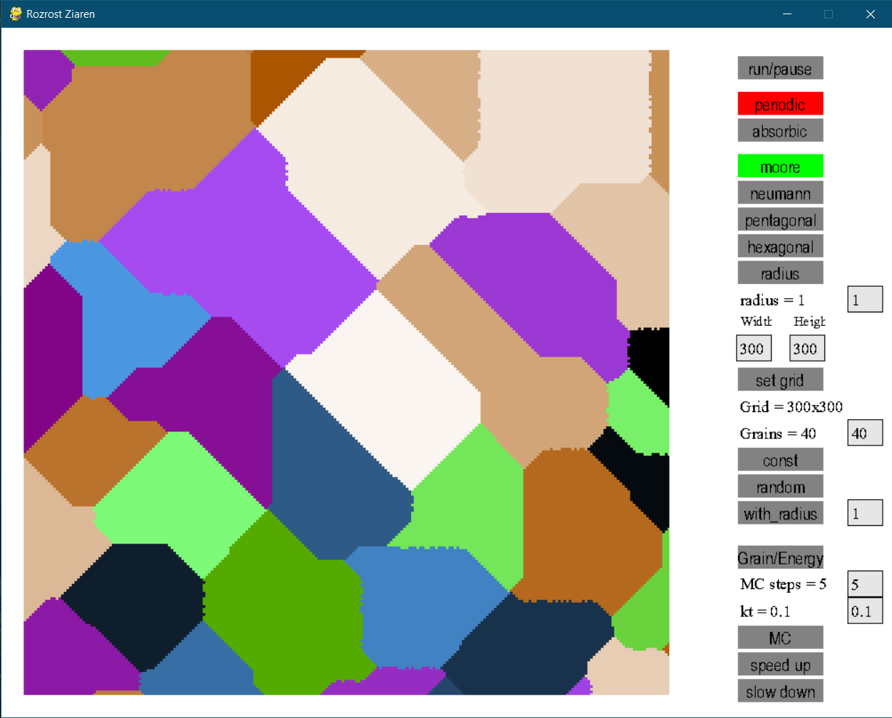
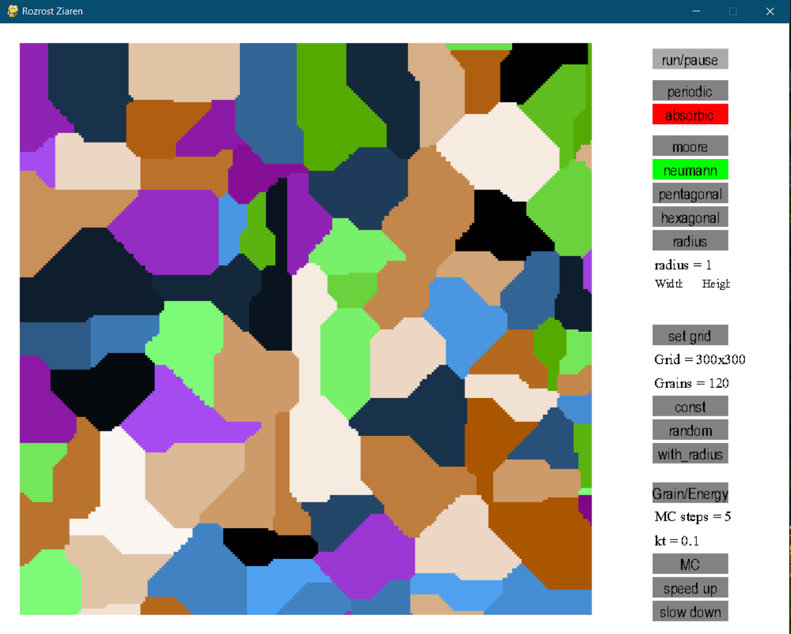
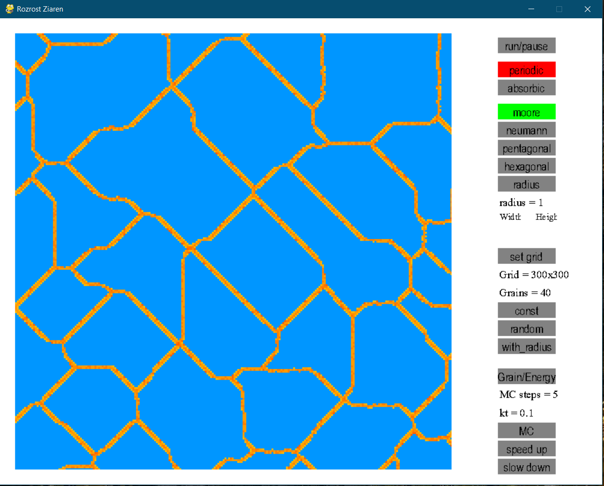
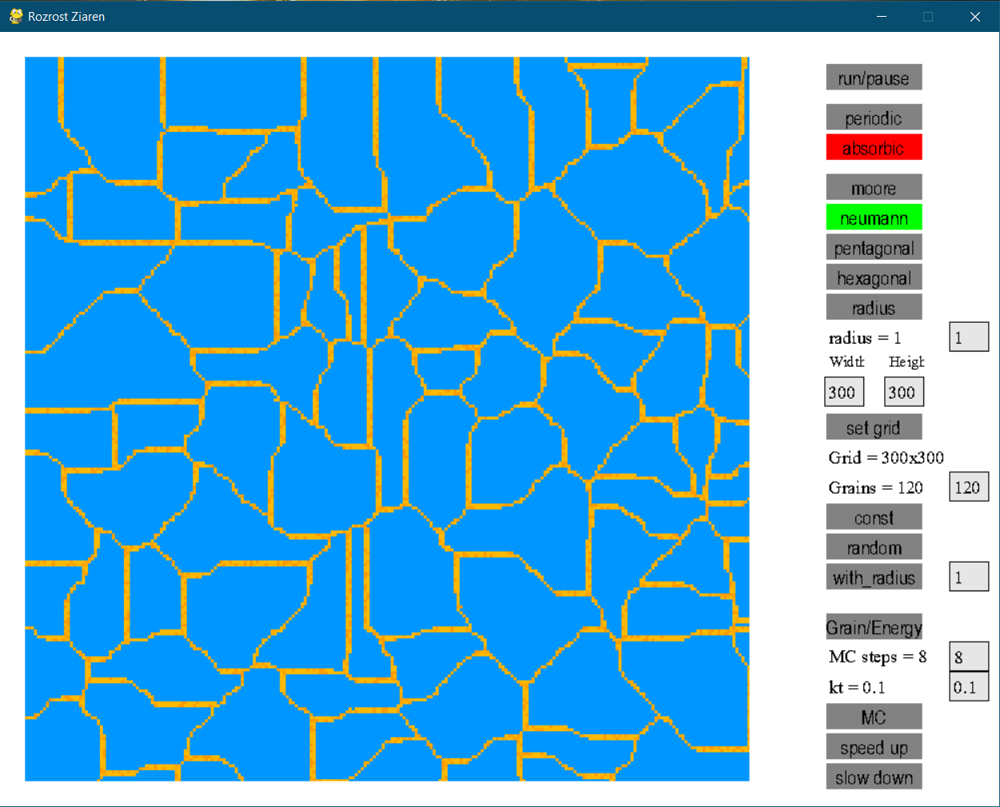

## Grains Growth ugin Cellular Automata 2D Student's Project
App for simulation and visualisation of Grains Growth with periodic and absorbic boundary condition, moore, neuman, pentagonal, hexagonal neighborhood types. 

User can chose: 
- boundary condition, 
- neighborhood type, 
- grid size, 
- const or random location of grains on grid

App also offers calculatin and visualisation of energy with Monte Carlo method

App was build using pygame and numpy

